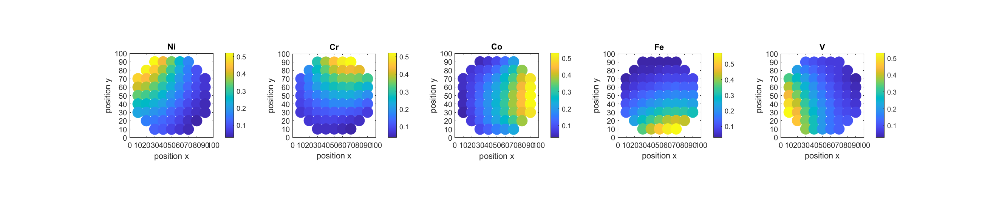
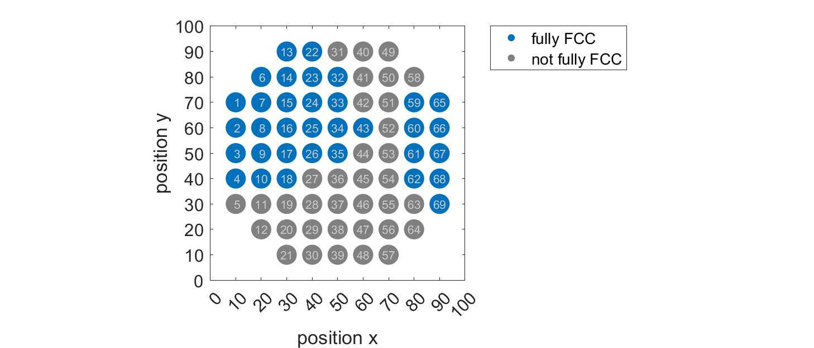
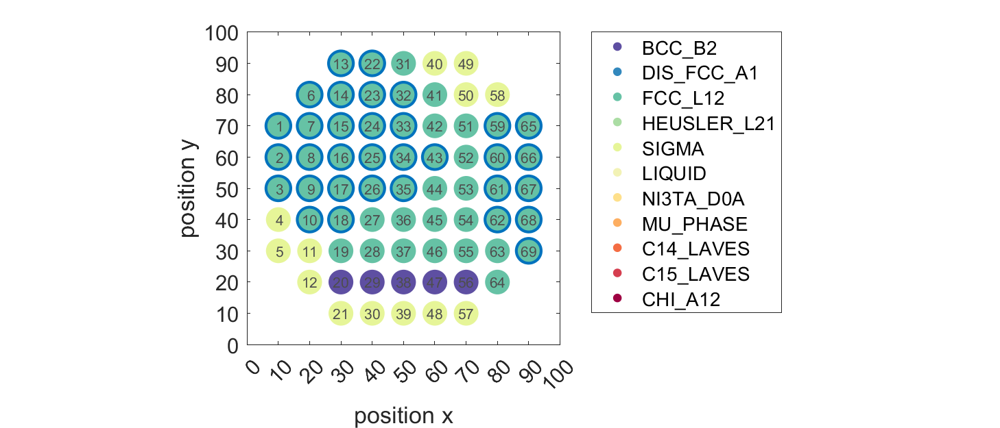
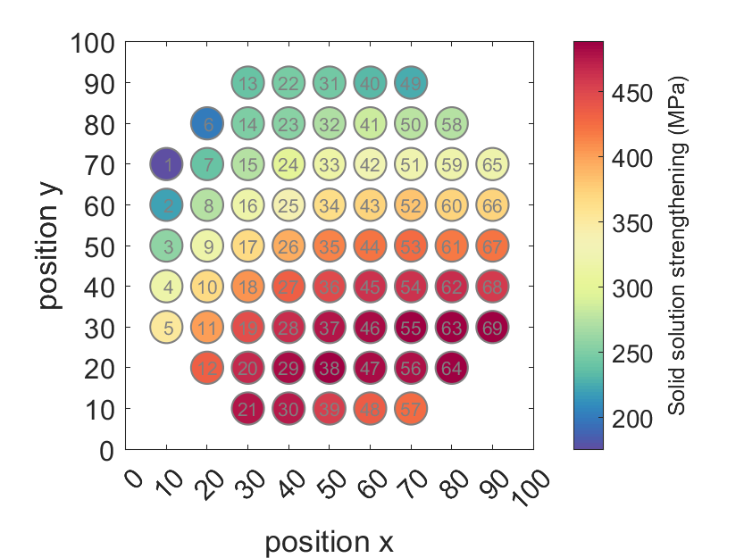

# combinatorial_mixing

## Overview

This repository contains the computational framework and data for exploring complex alloy compositions through combinatorial mixing. Our initial computational sampling employs a rotationally symmetric compositional contour, centered on the equiatomic composition, with a gradient of approximately 5-50 at.% for each element. This methodology samples 69 distinct regions, each representing an individual alloy by its averaged composition and structure. By varying the arrangement of sputtering targets, we substantially expand the sampled compositional space.

## Combinatorial Chemical Mixing

We delve into the complexity of quinary variants, specifically the $\text{Cr}_{x}\text{Fe}_{x}\text{Ni}_{x}-\text{X}_{x}\text{Y}_{x}$ variants, where elements X and Y are chosen from a pool of Co, V, Mn, Mo, Cu, Nb, W, Ti, Al, Si, and Ta. This approach yields 55 quinary elemental combinations. Each combination allows for the exploration of combinatorial chemical mixing across 120 target permutations, producing 69 unique alloys for each permutation. This leads to an initial computational analysis covering 455,400 alloy compositions.

## Phase Stability Assessment

The phase stability of each alloy composition is evaluated using two Gibbs energy construction methods aimed at identifying single-phase FCC regimes. These regimes can be fabricated using either:

- **Bulk casting-homogenisation:** Conducting a full equilibrium search for a single-phase FCC temperature window between $900^\circ\text{C}$ and $1300^\circ\text{C}$.
- **Combinatorial thin film:** Performing a minimum Gibbs energy search across the compositional space at a lower temperature of $200^\circ\text{C}$, comparing FCC with other potential phases.

## Solid Solution Strengthening Calculation

This repository offers a codebase for calculating solid solution strengthening, leveraging a generalized weak-pinning model that emphasizes the significance of statistical fluctuations in solute configurations for enhancing dislocation binding. The methodology, inspired by Leyson, Varvenne, Curtin et al., employs mechanical elasticity principles, where solute atoms acting as centers of dilation or contraction introduce volume misfits. Calculations consider factors such as the alloy's shear yield stress, energy barriers for thermally activated flow, and the initial tensile yield strength at various temperatures and strain rates, utilizing data from Pymatgen and the TCHEA4 database. This approach allows for a nuanced understanding of the compositional effects on solid-solution strengthening, supported by isotropic elasticity theory and CALPHAD-type evaluations for comprehensive alloy analysis.

## Thermodynamic Databases

Thermodynamic calculations leverage the TCHEA4 high-entropy alloy database from ThermoCalc software, utilizing CALPHAD methods. These calculations are facilitated through ThermoCalc's Software Development Kit, incorporating both batch calculations and Scheil-Gulliver simulations for selected alloys.

## Figures examples

### Compositional Contour

  

<!-- ### Full Equilibrium Phase Map

### Minimum Gibbs Energy Phase Map

### Solid Solution Strengthening

 -->  

<!--  -->

### Full Equilibrium Phase Map

### Minimum Gibbs Energy Phase Map

### Solid Solution Strengthening

